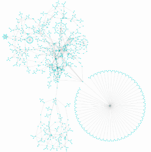
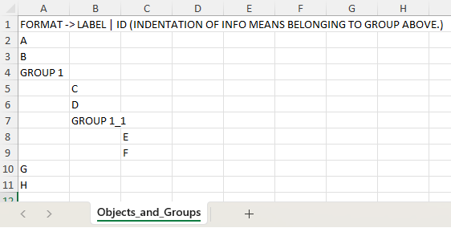
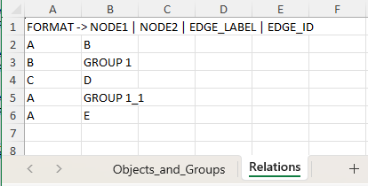

# Extended Python Support for yEd 

This Python library extends [yEd](http://www.yworks.com/en/products_yed_about.html) functionality through programmatic interface to graphs (of the [GraphML](http://graphml.graphdrawingraph1.org/) file format), including the following:

- [x] creating graphs
- [x] formatting graphs
- [x] reading graphs
- [x] bulk data addition or management (MS excel-based)
- [x] management of the yEd application (starting, killing, maximizing)
- [ ] enforcing rules on graphs
- [ ] addition of standard sorting methods
- [ ] graph comparison tools




# Basic Usage

Below are some basic usages of yEdExtended in interfacing with yEd and GraphML files:


## Installing yEdExtended

From GITHUB
```console
$ python -m pip install git+https://github.com/cole-st-john/yEdExtended
```
or *Coming soon, to PyPI!*
```console
$ pip install yedextended  
```


## Importing yEdExtended for usage

```python
import yedextended as yed
```


## Programmatically creating GraphML files

```python
# Instantiate graph instance
graph1 = yed.Graph()

# Add arbitrary graph detail - nodes and edges
graph1.add_node("a")
graph1.add_node("b")
graph1.add_edge("a", "b")

# Add arbitrary graph detail - group and group objects
group1 = graph1.add_group("group 1", shape="rectangle")
group1.add_node("c")
group1.add_node("d")
group1.add_edge("c", "d")
```

```python
# Adding graph objects based on csv input
with open("examples/test.csv", encoding="utf-8-sig") as csv_file: 
	csv_reader = csv.reader(csv_file)
	for row in csv_reader:
	    graph1.add_node(row)
```


## Using formatting

```python
graph1.add_node(
    "foo",
    font_family="Zapfino",
)

graph1.add_node(
    "foo2",
    shape="roundrectangle",
    font_style="bolditalic",
    underlined_text="true",
)

graph1.add_edge(
    "foo1",
    "foo2",
)
graph1.add_node(
    "abc",
    font_size="72",
    height="100",
)

graph1.add_node(
    "bar",
    label="Multi\nline\ntext",
)
graph1.add_node(
    "foobar",
    label="""Multi
Line
Text!""",
)

graph1.add_edge(
    "foo",
    "foo1",
    label="EDGE!",
    width="3.0",
    color="#0000FF",
    arrowhead="white_diamond",
    arrowfoot="standard",
    line_type="dotted",
)
```


## Manipulating data in MS Excel 

```python
# Manage data in excel (add/remove/modify objects)
graph1.manage_graph_data_in_excel() # default is object and hierachy management

# Manage data in excel (add/remove/modify relations)
graph1.manage_graph_data_in_excel(type="relations")
```

### Adding Objects / Groups per Excel:



### Result:


### Adding Relationships per Excel:



### Result:


## Possible outputs of Graph

```python
# Demonstrate stringified GraphML version of structure
print(graph1.stringify_graph())
```

```python
# Several methods of writing graph to file ==============================

with open("test_graph.graphml", "w") as fp:  # using standard python functionality
    fp.write(graph1.stringify_graph())

graph_file = graph1.persist_graph("test.graphml")   # using tool specific method

graph_file = graph1.persist_graph("pretty_example.graphml", pretty_print=True)  #  tool specific with formatting

```


## Opening files in yEd Application *(assumes yEd installed and on PATH)*

```python
# From existing handle
graph_file.open_with_yed(force=True)

# From file path
yed.open_yed_file("examples/test.graphml")
```


## Visualizing in yEd Application (Layout)

Following programmatic creation or modification of a graph, consider using the following keystrokes in yEd to improve layout / positioning:

- ``Tools -> Fit Node to Label``  (_Win: Alt + T + N_)
- ``Layout -> Hierarchical``  (_Win: Alt + Shift + H_)


# Options

Provides comprehensive support for ``node_shapes``, ``line_types``, ``font_styles``, ``arrow_types``, custom parameters, UML, complex and deeply nested relationship structures and more.


# Development


Interested in contributing or co-managing further development?  Just reach out!

Dev. Requirements:
```console
$ pip install pytest
```

To run the tests:
```console
$ PYTHONPATH=. pytest tests
```

References: 

+ [pyyed](https://github.com/jamesscottbrown/pyyed)
+ [GraphML Primer](http://graphml.graphdrawingraph1.org/primer/graphml-primer.html)
+ [NetworkX](https://github.com/networkx/networkx)
